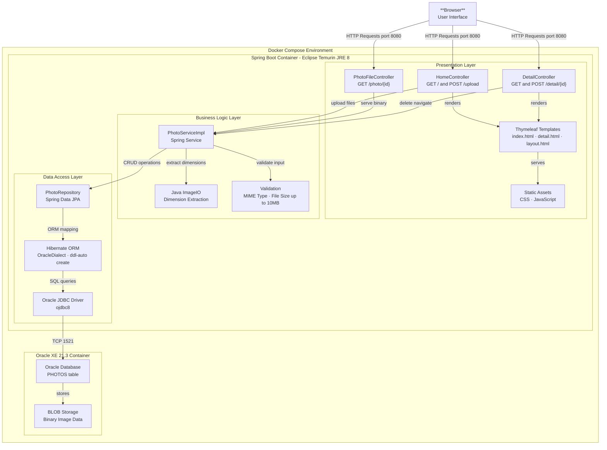

# Architecture Diagram

This diagram shows the high-level architecture of the Photo Album application, a Spring Boot web application that stores and serves photos using an Oracle database.

## Application Architecture

