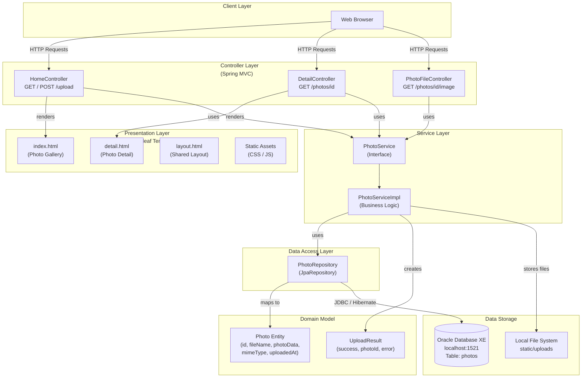

# Photo Album Application - Architecture Diagram

## Application Architecture

## Technology Stack

| Layer | Technology |
|-------|-----------|
| Language | Java 8 |
| Framework | Spring Boot 2.7.18 |
| Build Tool | Maven |
| Web / MVC | Spring MVC |
| Templating | Thymeleaf |
| Data Access | Spring Data JPA / Hibernate |
| Database | Oracle Database XE |
| File Storage | Local File System |
| Validation | Jakarta Bean Validation |
| Utilities | Apache Commons IO |
| Testing | JUnit 5, Spring Boot Test, H2 (in-memory) |
| Containerization | Docker / Docker Compose |

## Key Architecture Observations

- **Monolithic application**: Single deployable JAR containing all layers
- **Binary data stored in Oracle**: `photo_data` column (BLOB/LOB) holds raw image bytes
- **Dual storage approach**: Images stored both in Oracle DB and local file system (`static/uploads`)
- **Java 8 / Spring Boot 2.7.x**: Uses legacy `javax.*` packages (pre-Jakarta EE namespace)
- **No authentication/authorization**: All endpoints are publicly accessible
- **Single-node deployment**: No horizontal scaling support; file system path is not shared
